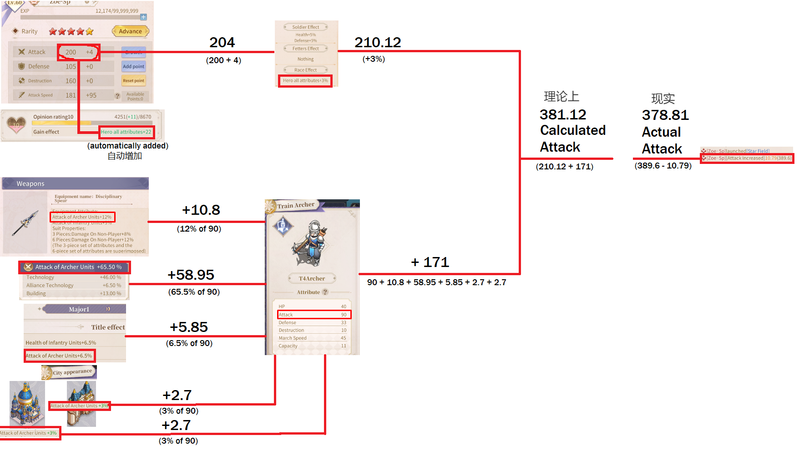

# General Guide

*A general guide for things that the game doesn't do a great job of explaining by itself.*
*It's a bit wordy, but there's a picture at the end i promise [24]*

> **Archived Steam Community guide.** Preserved here for safekeeping; all credit to the original author.  
> **Author:** [Lofthouse](https://steamcommunity.com/profiles/76561198109101612)  
> **Posted:** Feb 20, 2022 @ 7:51am &nbsp;·&nbsp; **Updated:** Apr 23, 2022 @ 9:26am  
> **Source:** [https://steamcommunity.com/sharedfiles/filedetails/?id=2759156753](https://steamcommunity.com/sharedfiles/filedetails/?id=2759156753)

## Contents

- [Chinese/English Discord server and random things](#chineseenglish-discord-server-and-random-things)
- [How to build a team](#how-to-build-a-team)
- [Academy and research](#academy-and-research)
- [Build order](#build-order)
- [How fights work](#how-fights-work)
- [Understanding skill descriptions](#understanding-skill-descriptions)
- [Status effects](#status-effects)
- [But what stats does my unit have during a battle](#but-what-stats-does-my-unit-have-during-a-battle)

## Chinese/English Discord server and random things

[https://discord.gg/nBjQmD7DPe](https://discord.gg/nBjQmD7DPe)

On Mobile, the game is titled "Lord of the Other World" and can be found on QooApp or Android store.  
On Steam the game is titled as "Trip in Another World"

Server 1, 2, and 3 are much older servers accessible to Mobile users only.  
Server 4 and onwards are accessible to both Mobile and Steam users.

Accounts are locked to where they are created on.

Regional chat allows players on any server to communicate with each other.

The playerbase mainly speaks Chinese.  
A language translation feature is available and translates very well.

## How to build a team

A team has 1 Commander unit and 2 other units.

Commander role  
- 25% less likely to be targetted by enemy normal attacks and skills  
- You lose if your commander loses all their troops. You win if the enemy commander loses all their troops.

Because the commander is less likely to be attacked or hit by status effects, you usually want to put a DPS unit as your commander and use your 2 other units to support them.

For your other 2 units you usually want:  
- A defensive/healing unit. Something like Pomon, Rhea, or Lafayette SP.  
- A debuffing unit. Something like Slider SP, Moussika, or Saintess Shin.

But it really depends on what units and skills you got.

<u>What troop to use</u>  
Each unit on your team can be assigned one type of troops.

Archers: ok movespeed, high attack, low health, low defence, low destruction  
Best for DPS commander

Infantry: ok movespeed, low attack, high health, ok defence, low destruction.  
Use on your other 2 units if you have healing on your team. healing is more effective on troops with higher health.

Cavalry: fast movespeed, ok attack, ok defence, ok health, low destruction.  
Use on your other 2 units if they still deal decent damage, or you just want to move fast.

Siege: slow movespeed, ok attack, low defence, ok health, high destruction  
Could use siege on debuffers. but they are so slow that maybe its better not to use them at all.

You start with tier 1 troops, and you can use the Academy to research higher tiers. Always research higher tier archers first to make killing enemies easier.

## Academy and research

The academy is used to research different technologies that improve your resource gathering, troops, and trade.

Just like any other building, it needs to be upgraded along with your city hall.  
When you are upgrading the academy, you cannot research anything so it is best to use building speedups to instantly upgrade your Academy, so that you can always be researching.

<u>What to research - Economic</u>

You should rush the research speed and building speed technologies. It is the best long term strategy.

You can max out some of the earlier researches since they don't take very long. But I wouldn't research anything else more than what is required to reach the "Advanced Research" - last research speed technology.

It's not worth researching technologies that increase resource gathering or production, since you can make a second account and use it to send resources to yourself if you ever run low.

<u>What to research - Trade</u>

You should rush to "Carriage" - the last caravan load technology. Increase that to an amount where you are comfortable reaching the trade limit every day.

You could also consider staying with 1 trade route forever, and levelling technologies related to the price of those 2 items. I do a trade route between Alonia and Amrittes, trading their city exclusive items. There might be better trade routes, but is it really worth worrying about?

<u>What to research - Military</u>

You should rush higher tiers of troops. You can max some of the earlier technologies since they are quick, but otherwise just try to get to tier 4 archers fast. Tier 5 archers takes a crazy long amount of time, so tier 4 will be the baseline for most players.

## Build order

Focus on levelling up your city hall. Each city hall level requires you to level up the following:  
1) Dwelling to the same level as your city hall (ONLY 1)  
2) Adventurers guild to the same level as your city hall - cannot upgrade until dwelling is done  
3) Academy to the same level as your city hall - cannot upgrade until adventurers guild is done  
4) get 1 other building to the same level as your city hall (a different pre-determined building at each city hall level)

You have 2 building queues available.  
Try to use 1 queue to progress through step 1, 2, and 3.  
Use your other queue to build Alliance hall, then progress step 4.

Building Alliance hall gives you more Alliance help.  
Where members of your guild cut down the time required for you to build.

Hopefully they both take roughly the same amount of time, but sometimes the step 4 building requires other buildings to be upgraded too.

As long as you are using both building queues to advance closer to the next city hall upgrade at all times, then you are doing good.

And speedup the Academy upgrades if you can. Since you can't upgrade the Academy and research at the time.

## How fights work

<u>Pre-battle phase</u>

Each fight consists of a pre-battle phase, then 8 rounds of combat.

In the pre-battle phase, many "Strategy" type skills apply their effects here. These could be buffs, debuffs, or status effects that aren't active until later rounds.

<u>Impasse</u>

The fight ends when either commander loses all their troops. If both commanders still have troops after 8 rounds, an impasse occurs.

In an Impasse, your team will wait 1 minute and you can decide what to do:  
1) Wait a full minute, then your team will do another 8 round fight with the enemy  
2) Leave the impasse to heal your troops back home  
3) Leave the impasse, then make your troops attack again. Skipping the 1 minute wait time.  
*Impasse functionality slightly changes in different game modes

<u>Combat</u>

During each round, the turn order for all units (your team and enemy team) is determined by each units individual speed.  
During a units turn, it makes a normal attack, then rolls the probability for any Chase/Tactical skills to activate. Then it goes to the next fastest unit to have their turn. Once all units have their turn, proceed to the next round.

The normal attack targets 1 enemy randomly and deals damage to that enemy.  
Skills that target enemies will target random enemies unless they specifically say otherwise.  
Skills that target allies will target random allies unless they specifically say otherwise.

You can view the battle log to see the breakdown of a fight.  
Once you build a Library, you can use it to simulate battles.

<u>Things to consider </u>

The damage an enemy deals to you is largely based on their troop numbers. So lowering the number of enemy troops is the best way to protect yourself.

But it also helps to have a skill that gives you an advantage early on. There are many strong units or skills that give you the upper hand for the first 3 rounds, such as Pomon, Rhea, Saintess Shin SP, Dream Eater, Set Ambush, Hesitate or Undercurrent. If you have one of these, you can stay relatively safe in the first 3 rounds, while lowering the enemy troops considerably with your attacks.

## Understanding skill descriptions

<u>"Affected by X attribute"</u>  
Some skills are increased by a certain stat, which they specify in the skill description.  
Attack - affected by attack attribute  
Speed - affected by speed attribute  
Defence - affected by defence attribute  
Destruction - affected by damage attribute

This means the effect of the skill is roughly multiplied for every 200 in the specified stat.

<u>"Damage Coefficient X"</u>  
This describes how much damage you can expect a skill to do. A damage coefficient of 1.00 is the damage of your normal attack.

<u>Strategy Skills (blue)</u>  
Skills that activate before a battle starts or during a specific round if that's what the skill description says. These skills cannot be prevented using status effects.

<u>Tactical skills (purple)</u>  
These skills have a probability of occurring every round when the unit has their turn.

<u>Passive skills</u>  
These skills buff the skill holder and cannot be prevented using status effects.

<u>Chase skills</u>  
These skills only have a chance to activate after the unit does their normal attack.

<u>1 round preparation</u>  
Found on some Tactical skills. When the skill activates, it does not apply its effect until the start of the units next turn.

<u>Counterattack</u>  
A unit with counterattack will strike back at any enemy that hits them with a normal attack.  
Example: Pomon skill Spirit Flame

<u>"Aid"</u>  
A unit with aid will redirect any attacks on allied troops to itself.  
Example: Rhea skill Star Shield

<u>"Combo attack"</u>  
Some units and skills let a unit do their normal attack twice in one round. Chase skills can also activate on both normal attacks.  
Example: Mia skill Divine Punishment

<u>"Healing Coefficient X"</u>  
Similar to damage coefficient, just for healing skills instead.

<u>Shield</u>  
Blocks the first instance of damage a unit receives.

<u>"Your own troops"</u>  
If a skill has this text, the effect relates only to the unit holding the skill  
Example: Zoe SP skill Spiritbound  
A skill that affects two allies randomly will say "2 of our troops"  
A skill that affects all 3 allies will say "3 of our troops"

<u>"Burning" or "Spell damage"</u>  
skills with this text damage the enemy before they take their turn.

<u>"Gain a strong attack... with real damage"</u>  
This text means after any normal attack or damage dealt by a skill, the unit will deal a fixed amount of damage based only on the units troop numbers and actual attack the unit has during a battle (see last section for how that is determined).  
Skills that deal damage multiple times, will also activate the fixed damage every hit.  
Example: Patra skill Ghost Bone.

<u>"Normal attacks will also Splash"</u>  
The damage from your normal attack will also be dealt as a percentage to the other 2 enemy units. The percentage that is dealt, depends on the damage coefficient of the Splash skill.  
Eg: a unit with a 0.60 damage coefficient splash will deal 60% of their normal attack damage directly to the other 2 enemies, completely ignoring their defence.  
For example: 4 star Slider skill Red Blade

## Status effects

<u>Disarm</u>  
Unit cannot normal attack

<u>Silence</u>  
Unit cannot use tactical skills

<u>Vertigo</u>  
It's like disarm + silence.

<u>Chaos</u>  
Makes a units normal attack and tactical/chase skills target completely randomly.

<u>State of forbidden healing/treatment</u>  
Unit cannot be healed

<u>Taunt</u>  
Unit must target the taunter with its normal attack. Does not apply if the unit is also in chaos

<u>In concentration/Immune</u>  
The unit will ignore any status effects on them during their turn. However, being immune does not remove status effects or prevent status effects from being applied on you.

<u>Counterattack</u>  
Your unit will automatically deal damage to any unit that attacks it with a normal attack. Once counterattack status is applied, it cannot be prevented by any status effects.

<u>Purify skills</u>  
Skills that remove status effects from allies

<u>Dispel skills</u>  
Skills that remove buffs or other positive effects from enemies

## But what stats does my unit have during a battle

The basic calculation is Unit stats + Troop stats.

<u>Unit stats</u>

Can be increased by 4 ways.  
1) Levelling up your units. Each stat has a different growth and increases by that amount each level.  
2) Adding stats manually. You get 1 stat point per level, which you can assign to any stat. You also get 10 stat points for each Advance, which requires dupes of the unit.  
3) Increasing the units favourability can increase all stats by up to 30.  
4) Race bonus/Troop bonus: +3% to all stats if your team has 2 units from the same race. +5% to all stats if your team has 3 units from the same race. You also gain up to 10% in certain stats if all 3 units in your team use the same type of troop.

<u>Troop Stats</u>

The stats each type of troop give can be seen in the barracks, archery range, stable, and siege workshop.

The troop stats are increased by many factors such as boosts from armour, technology, and titles before being added to the units stats.

You can check a units real stats by equipping a skill that increases their stats by a flat amount, and looking at the battle log. Since the battle log will tell you the amount that the stat was increased to.

You got to the end of the guide, so now you get a nice picture. It shows you roughly how the attack of a unit is determined during a battle.

