# Territory Wars and Raids

*Information about Territory Wars and Raids*

> **Archived Steam Community guide.** Preserved here for safekeeping; all credit to the original author.  
> **Author:** [Lofthouse](https://steamcommunity.com/profiles/76561198109101612)  
> **Posted:** Feb 28, 2022 @ 12:17am &nbsp;·&nbsp; **Updated:** Apr 23, 2022 @ 9:10am  
> **Source:** [https://steamcommunity.com/sharedfiles/filedetails/?id=2767325455](https://steamcommunity.com/sharedfiles/filedetails/?id=2767325455)

## Contents

- [What is a War/Raid](#what-is-a-warraid)
- [How to register for wars](#how-to-register-for-wars)
- [How to register for Raids](#how-to-register-for-raids)
- [When do wars occur - The war period](#when-do-wars-occur---the-war-period)
- [Territory ownership rules for Wars and Raids](#territory-ownership-rules-for-wars-and-raids)
- [Rewards for War/Raids](#rewards-for-warraids)
- [But how do wars actually work? like, really?](#but-how-do-wars-actually-work-like-really)
- [Siege Warfare](#siege-warfare)

## What is a War/Raid

All the people in your guild join forces to fight a large number of strong NPC enemies.

Wars are held at specific times on Friday to Sunday.  
Raids can be started by the guild leader or captain at any time from Monday to Thursday.  
Other than that, wars and raids function the same way. The fighting is the same.

Here is a video of a server 1 big city war.  
[https://youtu.be/1hh20-aOJeE](https://youtu.be/1hh20-aOJeE)  
Not many people show up to the Server 1 war...  
Here is a photo from a Server 4 war.

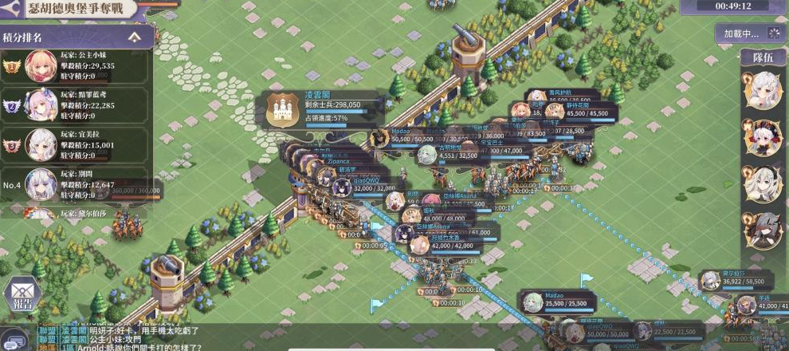

## How to register for wars

The Registration Period:  
Start of Monday 0000 UTC until Friday 1000 UTC.  
In-game time is displayed in UTC.  
I will use for convenience.

Guild leader or captain can spend league points to register for wars.  
League points are accumulated when people donate to guild.  
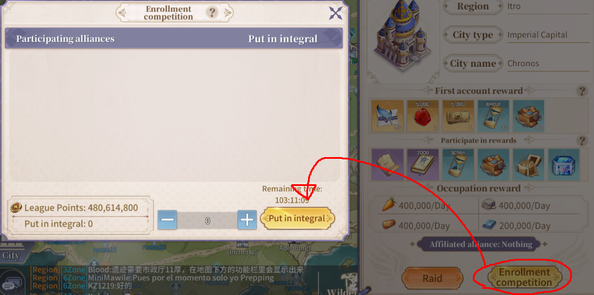  
If multiple guilds register for a war against the same territory - they will compete for that territory.  
You should avoid registering on territories that other guilds have already registered for.

Unless you want to prevent weaker guilds from taking first clear rewards?

## How to register for Raids

One raid is available to each guild on Monday, Tuesday, Wednesday, and Thursday.

Guild leader or captain can start the raid at any time.  
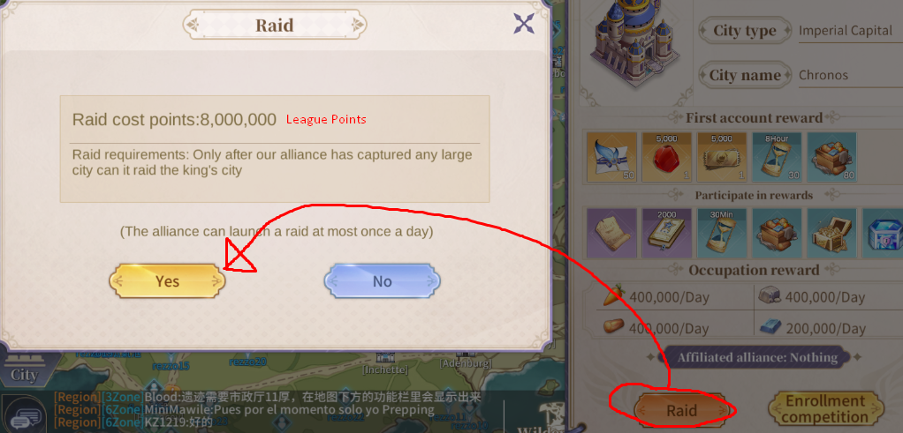  
Organise with your guild to find the best time for raiding.

## When do wars occur - The war period

1200 UTC Friday - Toll gate wars  
1200 UTC Saturday - Small city wars  
1330 UTC Saturday - Big city war  
1200 UTC Sunday - Chronos war

You can also see a countdown to any wars in the territory section of your guild:  
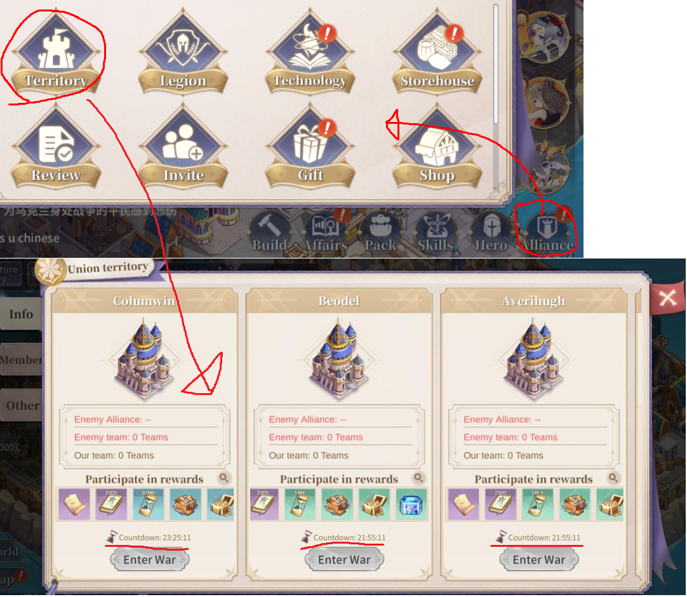

## Territory ownership rules for Wars and Raids

Each guild can only hold:  
- Maximum of 2 toll gates at a time  
- Maximum of 2 small cities at a time  
- Maximum of 1 big city at a time  
- Chronos

A guild claims a territory after a successful war or raid.

You cannot register for wars, or open a raid if you already own the maximum of that type of territory.  
For example: If you own 2 small cities, and want to raid a small city. You will have to abandon 1 of the small cities first.

You can register for toll gate wars freely.  
You must own at least 1 toll gate to register for a small city war  
You must own at least 1 small city to register for a big city war.  
You must own 1 big city to register for the Chronos war.  
The same rules apply to raiding.

<u>A GUILD CANNOT KEEP TERRITORIES IT ALREADY OWNS DURING THE WAR PERIOD</u>

A guild will lose ownership of all territories during each war period (Friday to Sunday).  
To avoid this, a guild should abandon its territories and register for new wars.  
This should be done on Friday before the war registration period ends at 1000 UTC.

Lets see some examples of how this should work:

<u>Example 1: my guild owns 2 toll gates.</u>

The guild leader/captain should register for 2 small city wars at any time in the Registration Period.  
On Friday before 1000 UTC: the guild leader or captain should abandon both toll gates and register for new toll gate wars.

The guild will then fight 2 toll gates on Friday 1200 UTC, and 2 small cities on Saturday 1200 UTC.

<u>Example 2: My guild owns 2 toll gates, 2 small cities, and 1 big city.</u>

The guild leader/captain should register for the Chronos war at any time in the registration period.  
On Friday before 1000 UTC: the guild leader or captain should do the following in sequence:  
1) Abandon 1 big city and register for a new big city war.  
2) Abandon 2 small cities and register for 2 new small city wars  
3) Abandon 2 toll gates and register for 2 new toll gate wars

The guild will then fight these wars during the already specified times

It must be done in this order. If you abandon the toll gates first, you won't be able to register for a small city war. Must start with your highest territory first.

It shouldn't need to be mentioned but...  
Make sure you register for territories that still have first clear rewards available.

## Rewards for War/Raids

Note: the rewards for toll gates, small cities, big cities, and Chronos are different.  
Check in-game for exact rewards from each type of territory.  
All examples shown are from Chronos.

Note2: Any rewards from wars or raids that the player is entitled to will be mailed once the 1 hour fighting period concludes.

<u>First Clear rewards</u>

Every territory has a generous reward of summons, gems, prestige, speedups, and resource boxes for the first guild that clears it.  
This reward is sent to the mail of every player in the guild, regardless of whether they participated or not.

Perhaps you could fill your guild with alt accounts and stockpile first clear gems on them.  
Those gems could then be used to accelerate guild technology.  
I'm sure nobody would do this though... Right?

You can see what the reward is on the territory screen.  
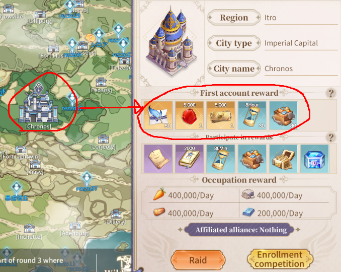

If a first clear is already claimed, it will no longer be shown on the territory screen.

It is ideal if all players gather in one guild to ensure that everyone can benefit from all the first clear rewards.  
Good luck trying to convince anyone of this obvious fact.

<u>Participation Rewards</u>

Anyone who earns 10,000 or more integral during a war or raid, will receive participation rewards  
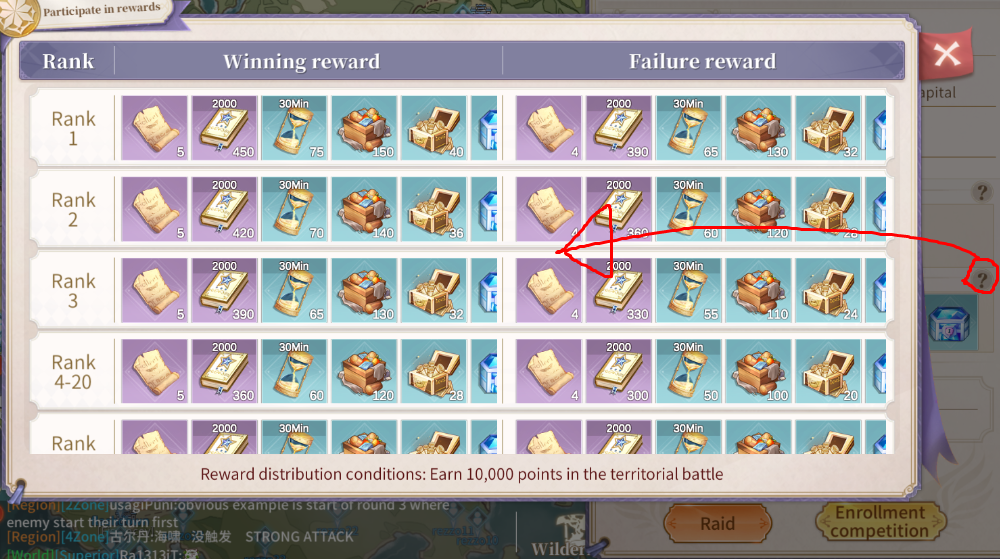  
If you have 5000 attacker integral and 5000 defender integral, then that will also count as 10,000 total integral and you will receive participation rewards.

If your guild defeats the territory and you have 10,000+ integral, you receive the "Winning Reward".  
If your guild does not defeat the territory and you have 10,000+ integral, you receive the "Failure Reward".

The difference is not much. Feel free to engage in wars that your guild cannot win, just to obtain 10,000 integral for the "Failure Reward", then leave.

You can use Raids to obtain "Failure Rewards" in this manner. Unless you want to use the raids to obtain first clear rewards instead.

<u>Occupation Reward</u>

While your guild occupies a territory, every day your guild storehouse will receive the amount of resources specified. This will help you accelerate guild technology.  
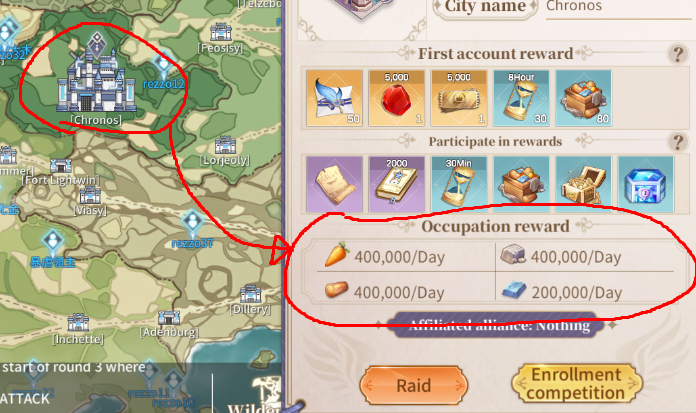

note: 400,000 food = 40W food

## But how do wars actually work? like, really?

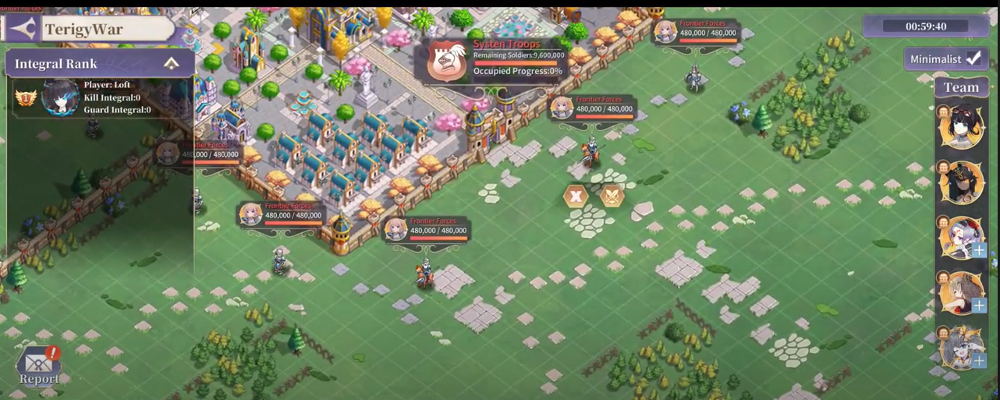

<u></u>  
<u>Some things to note.</u>

1) The war starts at 1200 UTC exactly (or 1330 UTC for big city war). The war is open for 1 hour. For toll gate and small city wars, you have 1 hour to defeat both of them. better be quick. If your guild is too weak, maybe you should only focus on one of them, and get 10,000 integral in the other.  
2) If you can beat a small city in about 25 minutes, you're probably ready for the big city.  
3) Most enemy teams feature Rhea as the commander, but she has different skills in each team.  
4) Your integral is shown on your left in the leader board. Guard integral is gained from sitting inside the fort once all enemies are defeated.  
5) You can leave the war at any time if all your troops are in base. There is a 1 minute penalty to rejoining the war or joining another war.  
6) You have a home fort that you can use to refill troops without leaving the war. The command to send troops home will make them return to the fort.  
7) Toll gate wars do not feature an enemy Fort. Only scattered enemies on the field.

All enemy Rhea commanders have a skill called Cautious  
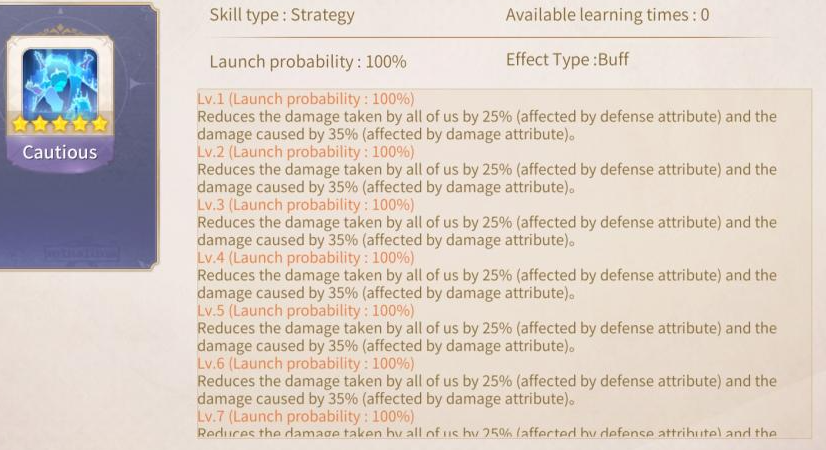

It reduces the damage dealt and received by the enemy Rhea and her allies.

If your team uses a Slider SP who is faster than the enemy commander, you can debuff the enemy stats before they can apply the effects of Cautious. This will lessen the effect of Cautious, making it easier to damage enemies, but they will also deal more damage to you.  
Is this a good thing? It depends.

<u>Defeating enemies outside the Fort</u>

You must defeat the enemies standing outside the enemy fort first. They are quite simple to defeat.

The top right enemy has undercurrent, and the bottom left enemy has Slider SP.  
Maybe a team with Patra should focus on those enemies?

The weakest enemy is in the middle with Derifa SP and Bellara.

The enemy above them has Roland, and Mousika. Quite dangerous.

<u>Taking on the Fort</u>

Once the outside enemies are defeated, you can take on the fort.  
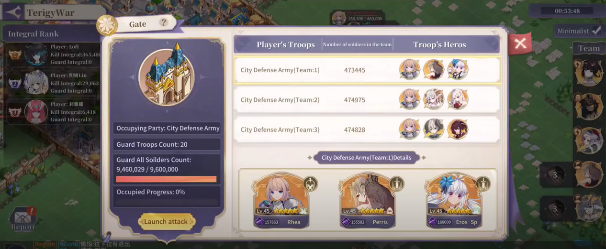

It is a gauntlet of enemy teams.

You can check the skills of the enemy units by clicking their portraits.

Most units always possess a specific set of skills.  
Maybe this information could be useful to you.

For example, Eros SP and Saintess Shin always possess undercurrent.  
Maybe a team with Zoe SP should wait patiently.

The Fort enemies use a troop tier that is 1 higher than the enemies outside the fort, so they are considerably stronger.

If you attack the fort, and neither team loses, it will cause an impasse. If another team enters the impasse, your team will start returning to base.

If you defeat an enemy team, your team will also start returning to base.  
You can cancel this and attack the fort again if you want to.  
.

<u>The final 2 enemies</u>

The 2nd last enemy has Saintess Shin SP. Her chaos skill makes it difficult to defeat her.

The final enemy has a Lord as commander instead of Rhea.  
This lord has a skill called Goddess Bless instead of Cautious. It provides a stronger effect than Cautious, while also granting immunity to the Lord and his allies for 3 rounds.  
His team also has very high damage skills, shields, and status effects to use against you.  
Weaker players may not be able to harm him at all.

The toll gate war does not have a fort so there is no Lord.  
The small city war has 1 Lord at the end of the fort.  
The big city war has 2 Lords. One at the half way point, and one at the end.  
The Chronos war has 3 Lords. At 1/3 and 2/3 into the Fort, and a final stronger Lord at the end.

<u>What to do after you defeat all enemies</u>

To capture the territory, you have to put teams inside the enemy fort until the capture bar reaches 100%.  
Once it's at 100%, everyone can leave. Your guild will claim the territory and all rewards will be distributed once the 1 hour war period has ended.

## Siege Warfare

Siege teams can be used to deal damage directly to the enemies within the enemy fort.  
You can start siege warfare immediately.  
You do not have to wait for the scattered enemies to be defeated.

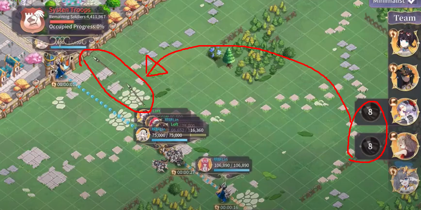  
A team can partake if siege warfare if:  
1) the team commander is using siege  
2) the team is close enough to the enemy fort

The button can be pressed every 30 seconds, and you're team will launch a projectile at the fort, causing a random enemy team in the fort to take a small amount of damage.

The damage a siege team deals is based on 2 factors:  
- The destruction of each unit (including destruction from troops and buffs from technology)  
- Number of troops

<u>The fort strikes back</u>

Sometimes a siege team gets attacked by a random enemy inside the fort.  
This is not good because your siege team will probably be underlevelled and not have any good skills.

The losses can be mitigated using a 1 troop commander strategy

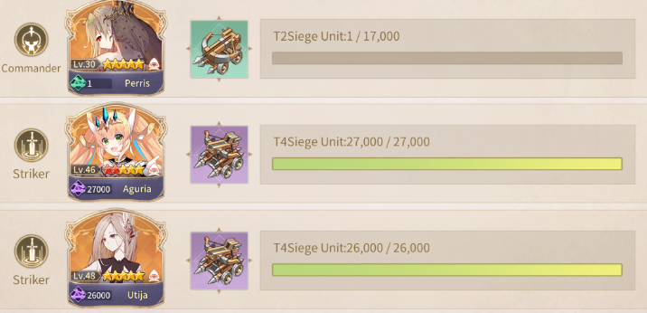  
Note: all units are the same race for 5% increased stats.

Since your commander only has 1 troop, your team will usually lose immediately with no troop losses.  
They will then return to base automatically, and you can refill their troops and return to the field.

Have a lower tier of the same troop with very few troops only, which the commander will use.  
When the team returns to base, the commander has no extra troops that they can refill but the other units can refill easily if they took any damage.  
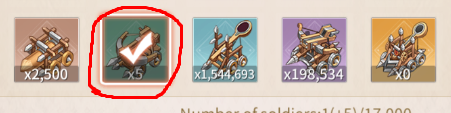  
You can also use a 1 troop commander team with cavalry to attack the enemy repeatedly.  
Saintess Shin SP has been used with this strategy before.  
Make the enemies deal damage to themselves, then quickly exit the fight with no losses.

I wouldn't rely on it, but it could be worth deploying if you haven't levelled many units.
