# Various unrelated pieces of information

*Information that is still useful. But doesn't need its own guide.*

> **Archived Steam Community guide.** Preserved here for safekeeping; all credit to the original author.  
> **Author:** Lofthouse  
> **Posted:** Mar 8, 2022 @ 6:42am &nbsp;·&nbsp; **Updated:** Mar 30, 2022 @ 6:13pm  
> **Source:** [https://steamcommunity.com/sharedfiles/filedetails/?id=2768347161](https://steamcommunity.com/sharedfiles/filedetails/?id=2768347161)

## Contents

- [Prestige information](#prestige-information)
- [The requirements of each city hall level](#the-requirements-of-each-city-hall-level)
- [Event Schedule](#event-schedule)
- [Increasing the damage of skills that deal "Real damage only affected by attack and troop numbers"](#increasing-the-damage-of-skills-that-deal-real-damage-only-affected-by-attack-and-troop-numbers)
- [farming Astral Badges with pvp](#farming-astral-badges-with-pvp)
- [Upgrading troop exoskeleton](#upgrading-troop-exoskeleton)
- [If you want to spend money](#if-you-want-to-spend-money)
- [making a second aid account and mining gems](#making-a-second-aid-account-and-mining-gems)

## Prestige information

<u>Daily gifts at each prestige level</u>  
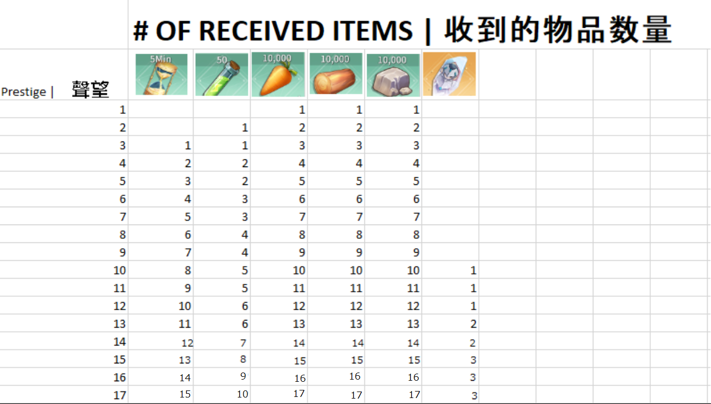

.

<u>Prestige benefits</u>  
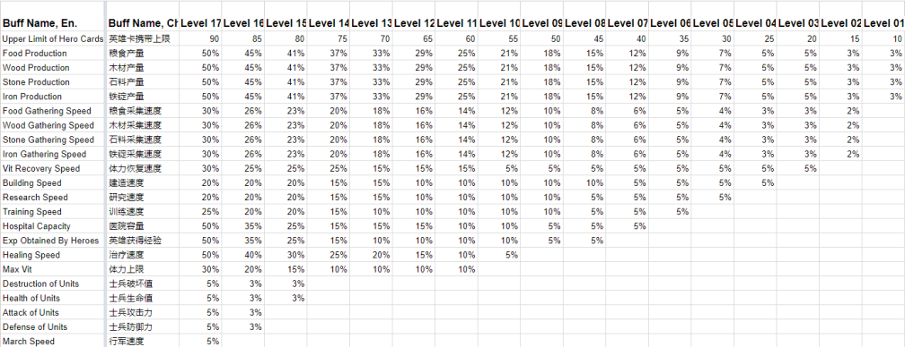

## The requirements of each city hall level

Each city hall level, you must level up the dwelling, adventurers guild, academy, and one extra building.

the list is written as "when the city hall is LVL X, what extra building do you need to upgrade to the same level before you can upgrade city hall"

Example: for city hall 8 --> 9 you need an to level one iron mine to level 8.  
Its not complete yet. There are some uncertainties.

1 no extra  
2 no extra  
3 no extra  
4 hospital  
5 farm  
6 lumber mill  
7 quarry  
8 iron mine  
9 alliance centre  
10 hospital (requires stable. also require farm)  
11 storehouse  
12 barracks (requires farm)  
13 archery range (requires lumber mill)  
14 Information Station  
15 Blacksmith Shop (requires iron mine)  
16 Hospital (requires barracks, which also require farm)  
17 shop (requires storehouse)  
18 trading post? (requires trading station, information station)  
19 siege workshop (requires stable, barracks, archery range. which also require farm, quarry, lumber mill)  
20 blacksmith (requires iron mine)  
21 Hospital (requires archery range)  
22 Shop (requires storehouse)  
23 trading post (requires trade station and information station)  
24 siege workshop (requires stable, barracks. archery range. which also require farm, quarry, lumber mill).  
25 is the max city hall level. no buildings can go past 25.

## Event Schedule

<u>Events follow an 12 day pattern.</u>

Most of them have a simple requirement which when completed, give you some resources, speedups and 100 gems. They will go for 2 days, and you can complete it on each day.

<u>Leaderboard events</u>  
On top of the normal rewards, some events feature a leader board which gives extra rewards at the end of the event.

<u>Exchange shop events</u>  
The Vigorous Development event features an exchange shop where you can buy rewards using currency obtained during the event. By completing all the tasks every day to obtain currency, you can buy all the rewards in the exchange shop.

<u>Seasonal events</u>  
There are seasonal events during times like Christmas, Easter, or Valentines day. These operate similar to exchange shop events, but the rewards are much better.

You can see a Calender of events from the events menu.  
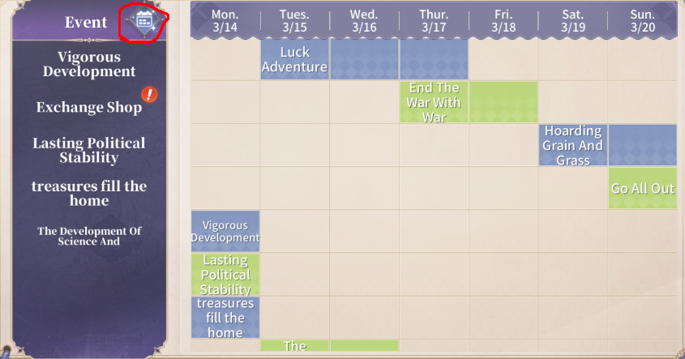  
<u>Day 1</u>  
Luck Adventure - summon units  
End the War with War - defeat rebels

<u>Day 2</u>  
End the War with War - defeat rebels  
Thriving - increase prosperity

<u>Day 3</u>  
Hoarding Grain and Grass - gather resources  
Thriving - increase prosperity

<u>Day 4</u>  
Hoarding Grain and Grass - gather resources  
Go All Out - spend vitality. Features a leader board

<u>Day 5</u>  
Go All Out - spend vitality. Features a leader board  
An Irresistable Force - Train troops

<u>Day 6</u>  
An Irresistable Force - Train troops  
Vigorous Development - Complete tasks to get medals that can be used in an exchange shop.

<u>Day 7</u>  
Vigorous Development - Complete tasks to get medals that can be used in an exchange shop.  
Lasting Political Stability - defeat barbarian towers  
Treasures fill the home - Spend gems on anything. Features a leader board  
Speedup event - Spend speedups on building, research, or either. It changes every 8 day event cycle. Features a leader board

<u>Day 8</u>  
Vigorous Development - Complete tasks to get medals that can be used in an exchange shop.  
Lasting Political Stability - defeat barbarian towers  
Treasures fill the home - Spend gems on anything. Features a leader board  
Speedup event - Spend speedups on building, research, or either. It changes every 8 day event cycle. Features a leader board

<u>Day 9</u>  
Vigorous Development - Complete tasks to get medals that can be used in an exchange shop.  
Lasting Political Stability - defeat barbarian towers  
Treasures fill the home - Spend gems on anything. Features a leader board  
Speedup event - Spend speedups on building, research, or either. It changes every 8 day event cycle. Features a leader board

<u>Day 10</u>  
Luck Adventure - summon units  
The Caravan Trade - trade using caravans

<u>Day 11</u>  
Luck Adventure - summon units  
The Caravan Trade - trade using caravans

<u>Day 12</u>  
Luck Adventure - summon units  
The Caravan Trade - trade using caravans

## Increasing the damage of skills that deal "Real damage only affected by attack and troop numbers"

DISCLAIMER: this section is only talking about the fixed damage. Not the damage from Rolands Counterattack. Not the 1.00 damage coefficient of Ghost Bone. Just the fixed damage part where it says "Assault effect to trigger" in the battle log

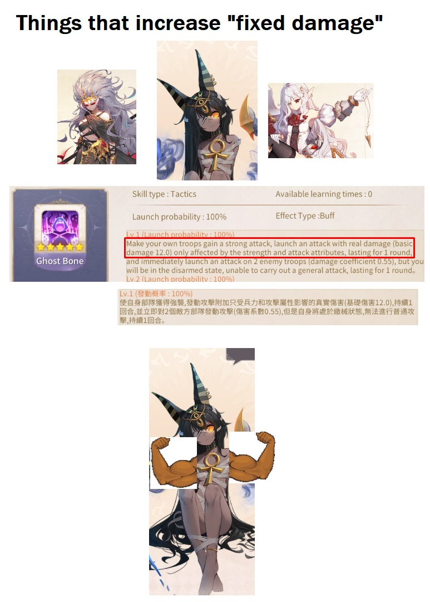  
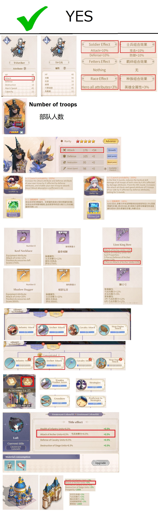

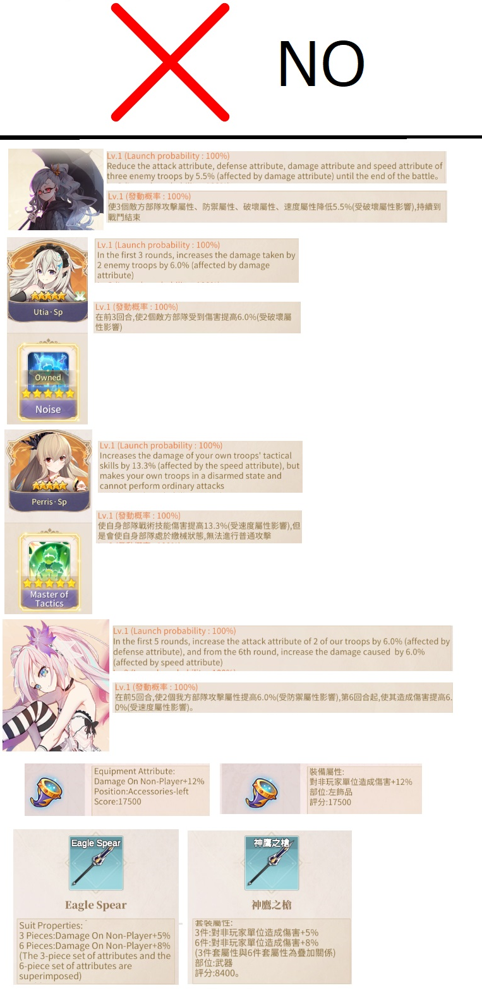

note: Derifa probably should work, but it doesn't. I think her skill is bugged because it doesn't actually add any attack with its effect.

note: Rolands counterattack, and Patras Ghost Bone still deal good damage by itself. It may still be better to use damage to NPC equipment.  
note2: Patra does not deal more damage when Slider SP is on your team. Patra also does not deal less damage if Slider SP is on the enemy team.

## farming Astral Badges with pvp

**This method does not work anymore. Patched.**

Astral Badges are used to increase your Title, which provides buffs to your troop stats. The medals are also used to buy items in the Title shop.  
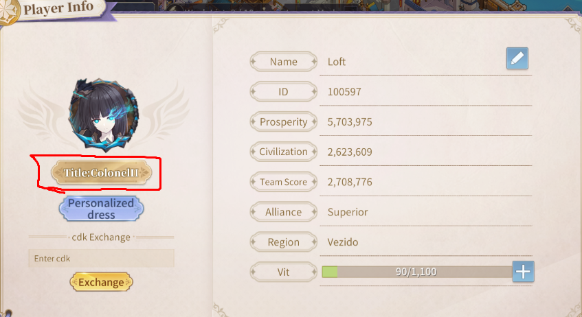

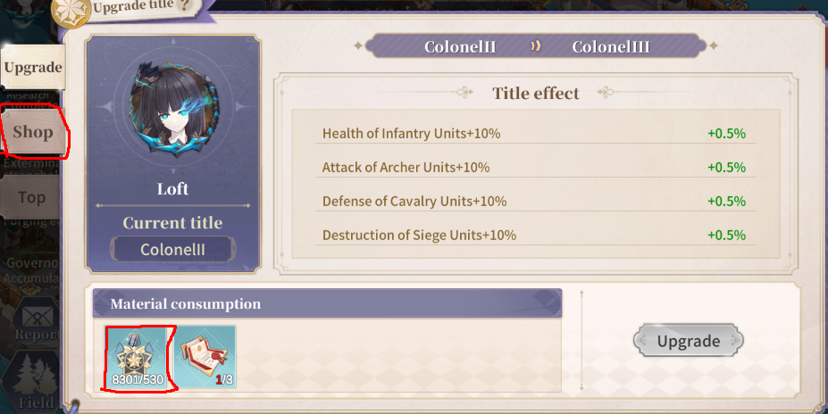

.  
You can farm these medals by fighting barbarian towers in the World map. An easier method is doing pvp against another account.  
You can set up a 1 troop commander team and constantly fight another players team. Both players will receive 1 medal per battle. Keep going until you hit the daily badge cap.

To make it easier, move your cities next to each other with the item below from Guild Shop.

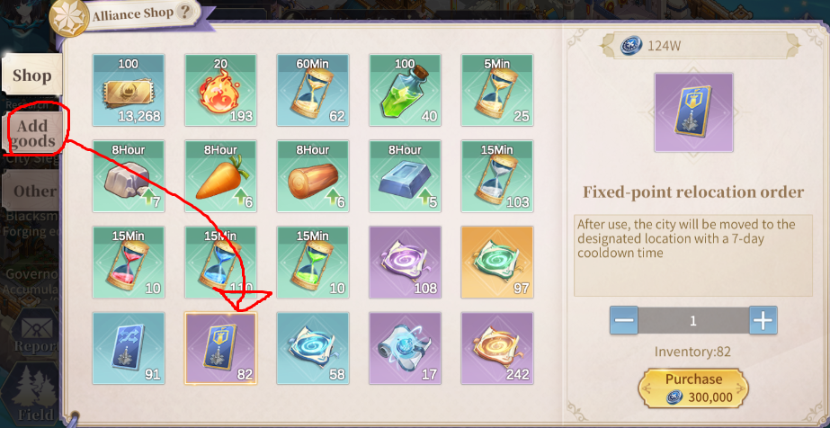

note: A guild leader or admin will need to add it to the guild shop first.

You can do this strategy with another player to both receive medals. Or you can do it with a second account you own, to make it easier for yourself.

Follow the link below to see a video of this strategy.

[https://youtu.be/S2eikpFg3KI](https://youtu.be/S2eikpFg3KI)

## Upgrading troop exoskeleton

Each troop type has a cosmetic armour that can be purchased for 5888 gems.  
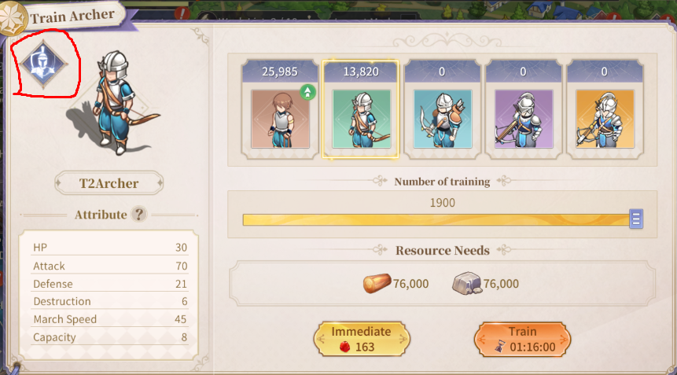

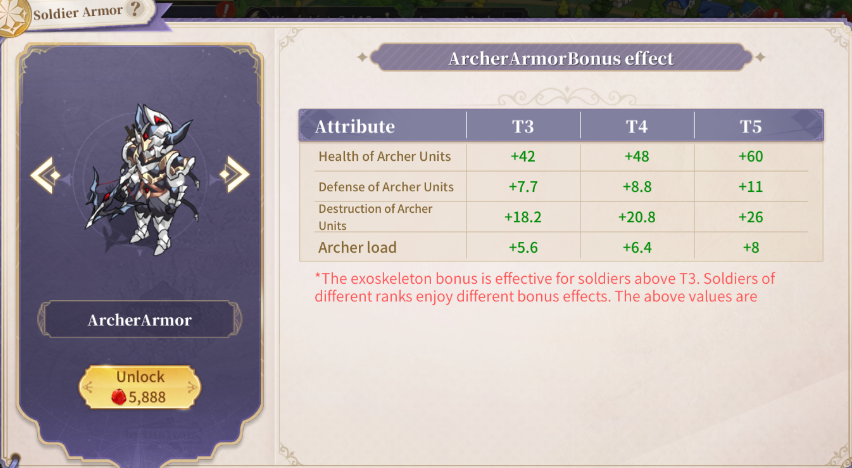

.  
Once purchased, the cosmetic armours can be upgraded to gain stats slowly. The upgrades cost alot of gold, and need items called hearts that are obtained from World bosses or the Title shop.  
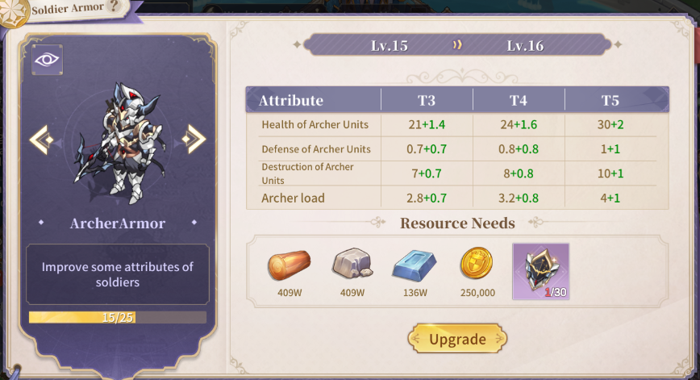

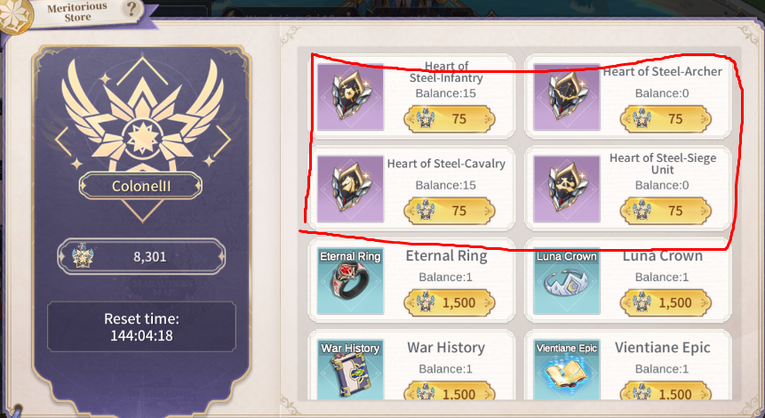  
The drop rate from world bosses is maybe 5%? so really the title shop is the only way to obtain them. The Title shop sells 15 of each heart per week so upgrading the armour is a slow process.

Level 1-14: you need 15 Hearts per upgrade.  
Level 15-?: you need 30 Hearts per upgrade.

The stats gained from upgrading are only the secondary stats of each troop type.  
Archers don't gain more attack.  
Cavalry don't gain more defence.  
Infantry don't gain more health.  
Siege don't gain more destruction.

They only sure up the stats that they are already deficient in.

## If you want to spend money

Note: in-game prices are shown in USD for english players. The conversion rates for different currencies seem pretty far from what I've seen.

<u>Best one-time purchases</u>

Prestige gift pack Pomon  
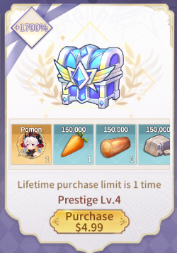

Pomon is very good. Probably worth it to give you an easier time early on. Could also buy Synaga for 1$ but she isn't worth using in the long run. Might not need to buy Pomon if you are rerolling accounts on mobile for a good unit to start with.

Growth Fund  
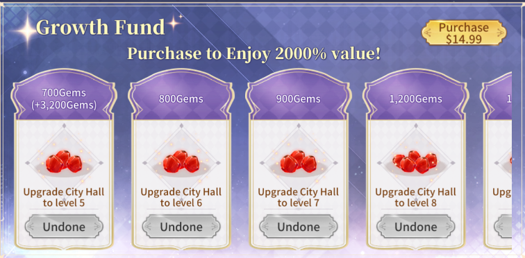

Lots of gems as you level up. Best value for gems.

<u>Best ongoing purchases</u>

5$ monthly card  
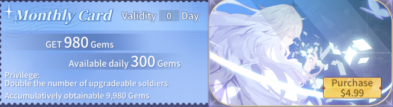

You get the gems every day in the mail.

<u>Whale territory</u>

15$ monthly card  
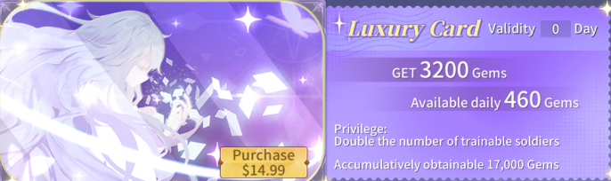

not as good value as the 5$ monthly card, but still better than buying gems directly.

15$ Adventures of Santo bottom row  
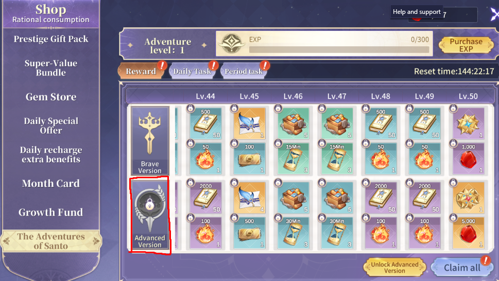

.  
Nothing else is worth buying unless you are the son of an arabian prince.

## making a second aid account and mining gems

At City hall 10 you can build the trading post which allows you to send resources to another guild member.  
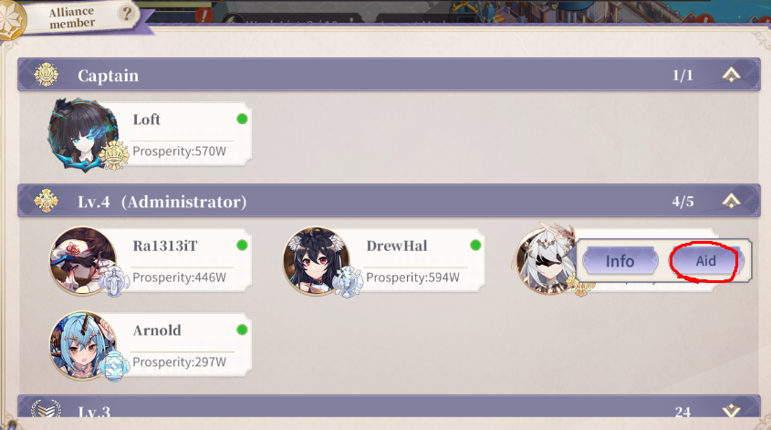

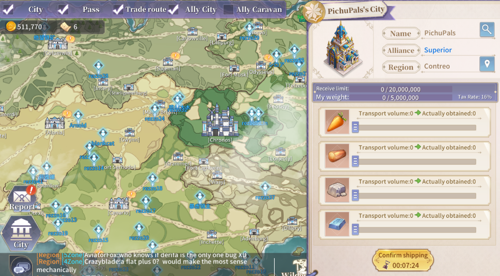

.  
You can also raise some alternate accounts on mobile and use them to send resources to your main account every day.

With this method, you can take some burden of your gathering teams, and use them to gather gems in the world instead.

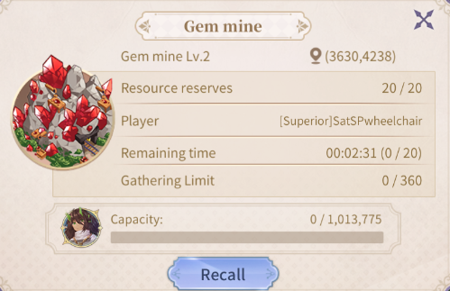  
You can gather gems until the gathering limit is full. The gathering limit increases every city hall level. The maximum is 400 at city hall 25, which becomes full after you gather about 500 gems in one day.
